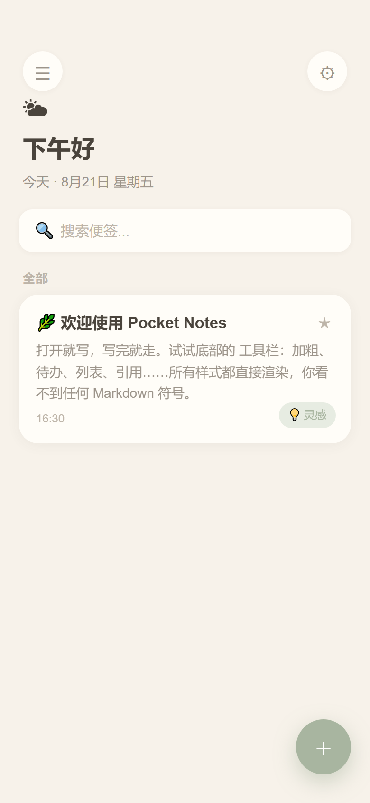
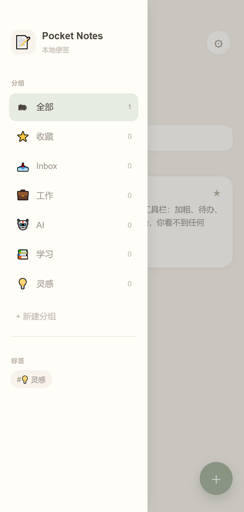
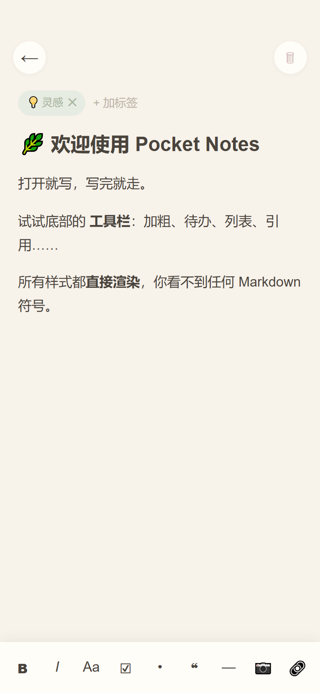

# 🌿 Pocket Notes · 极简便签

> 打开就写，写完就走。

Pocket Notes 是一款手机端**极简便签** App。它不是 Markdown 编辑器、不是知识库、不是文档软件，更像一本放在口袋里的纸质便签。

整体气质参考 **Apple Notes**（编辑体验）、**Bear**（排版）、**Craft**（动画与细节）、**Apple Journal**（氛围），统一走 **Apple HIG + Craft + Bear** 的柔和治愈风——没有学习成本，打开第一感觉是「好舒服」。

---

## ✨ 特性

- **富文本即写即显**：加粗、斜体、标题、待办、列表、引用、分割线、图片、链接——所有样式直接渲染，你**永远看不到任何 Markdown 源码**（`#`、`**`、`- [ ]` 之类都不会出现）。
- **打开就写**：首页只有「问候 + 搜索 + 卡片流 + 新建」，没有头像 / 天气 / 统计 / AI。
- **自动保存**：输入即存、退出即存，不用点保存；状态显示「已保存」后淡出。
- **首页侧边栏分组**：全部 / 收藏 / Inbox / 工作 / AI / 学习 / 灵感 / 临时 / AI Prompt，支持新建分组，点击即筛选。
- **收藏**：每张便签右上角 ☆ 一键收藏，并在「收藏」分组查看。
- **标签筛选**：胶囊标签（🏠 家装 / 💡 灵感 / 📚 学习 / 🌸 日常），失焦自动保存，点击即筛选。
- **全文实时搜索**：搜索框实时过滤标题与正文。
- **深色模式**：暖黑背景、低对比度，阅读不刺眼。
- **纯本地**：数据存在本机，无需登录 / 联网 / 注册；预留 WebDAV / iCloud / GitHub 同步接口，默认关闭。
- **治愈系设计**：奶白底、莫兰迪配色、20px 圆角、极轻阴影、180–220ms 动画（淡入 / 轻缩放 / 滑动）。

---

## 📱 截图

| 首页 | 侧边栏分组 | 编辑页 |
| --- | --- | --- |
|  |  |  |

---

## 📦 下载

- **Android APK**：到 [Releases](https://github.com/yingying-moon/pocket-notes/releases) 页下载 `PocketNotes-debug.apk`，传到手机安装即可（首次安装需允许「未知来源应用」）。

---

## 🛠 从源码构建安卓 APK

仓库里的 `index.html` 就是完整源码（单文件，直接用浏览器打开也能跑）。打包成安卓 App 用 [Capacitor](https://capacitorjs.com/)：

```bash
npm init -y
npm i @capacitor/core @capacitor/cli @capacitor/android
npx cap init PocketNotes com.pocketnotes.app --web-dir .
npx cap add android
npx cap sync android
cd android && ./gradlew assembleDebug
# 产物：android/app/build/outputs/apk/debug/app-debug.apk
```

> 环境要求：Node.js + Android Studio（含 Android SDK 与 JDK）。

---

## 🗂 项目结构

```
pocket-notes/
├── index.html              # 完整源码（单文件，可直接浏览器打开）
├── assets/screenshots/     # 应用截图
├── LICENSE                 # MIT
└── README.md
```

---

## 📄 开源协议

[MIT](LICENSE) © 2026 盈盈 (yingying-moon)
